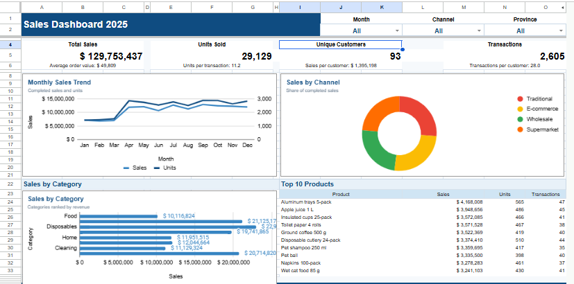
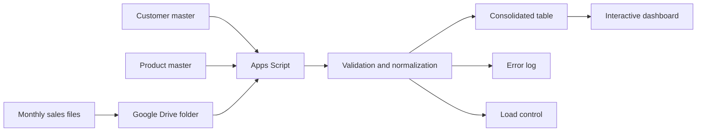

# Automated Sales Reporting & Data Quality Pipeline

An end-to-end reporting solution built with **Google Sheets, Google Drive, and Google Apps Script**. The project automates the consolidation of monthly sales files, validates data quality, records processing issues, and refreshes an interactive executive dashboard.

> Portfolio project focused on spreadsheet automation, data validation, reporting, and business intelligence.

## Project objective

Replace a repetitive manual reporting process with a controlled workflow that can:

- consolidate 12 monthly sales files from Google Drive;
- standardize inconsistent headers, formats, and values;
- validate customers and products against master tables;
- prevent duplicate transactions and reject critical errors;
- correct recoverable inconsistencies and keep an audit trail;
- update commercial KPIs, charts, rankings, and filters automatically.

## Interactive dashboard

[Open the Google Sheets dashboard](https://docs.google.com/spreadsheets/d/1THt9u8sw1mRxW28qljmpSoeEN-kNSqSmX-nY9JkyBPI/edit)



The dashboard was designed to fit in a single view and includes filters for **Month**, **Channel**, and **Province**.

## Key results

| KPI | Result |
|---|---:|
| Total sales | $129,753,436.60 |
| Units sold | 29,129 |
| Unique customers | 93 |
| Completed transactions | 2,605 |
| Source records read | 3,840 |
| Valid records loaded | 3,835 |
| Rejected records | 5 |
| Logged warnings | 4 |
| Monthly files processed | 12 |

## Business findings

- **September** recorded the highest monthly sales, at approximately **$12.93M**.
- Channel performance was balanced: each of the four channels contributed roughly one quarter of total sales.
- **Disposables** was the leading category, followed by **Beverages** and **Pets**.
- **Aluminum trays 5-pack** was the highest-selling product, generating approximately **$4.17M**.
- The validation layer rejected five critical records and documented four recoverable issues before refreshing the report.

## Data pipeline



1. The user places each monthly file in the configured Google Drive folder.
2. The custom menu runs `actualizarReporte()`.
3. Apps Script identifies the source files and reads the customer and product masters.
4. The process standardizes fields, validates business rules, removes duplicates, and recalculates inconsistent totals.
5. Valid rows are written to `Base_Consolidada`; rejected records and corrections are logged in `Errores`.
6. File-level results are written to `Control_Carga` and the refresh timestamp is updated.
7. Dashboard formulas, KPIs, filters, and charts recalculate from the consolidated data.

## Dashboard components

- Executive KPIs: sales, units, customers, and transactions
- Monthly sales trend
- Sales by channel
- Sales by category
- Top 10 products
- Data-quality summary
- Interactive selectors for month, channel, and province

## Validation rules

- `Sale_ID` must be present and unique.
- Dates, quantities, prices, discounts, and totals must be valid.
- Customer and product codes must exist in their master tables.
- Category values are checked against the product master.
- Total amount is verified against `Quantity × Unit Price × (1 − Discount)`.
- Recoverable formatting issues are corrected and logged as warnings.
- Critical inconsistencies are rejected and recorded with their source file and row.
- Commercial KPIs include only transactions with `Completed` status.

## Tools

- Google Sheets
- Google Drive
- Google Apps Script
- Spreadsheet formulas, charts, and data validation

## Repository structure

```text
automated-sales-report-portfolio/
├── README.md
├── apps-script/
│   ├── Code.gs
│   └── README.md
├── dashboard/
│   └── README.md
├── docs/
│   ├── data_dictionary.md
│   ├── portfolio_presentation.md
│   ├── validation_rules.md
│   └── workflow.md
└── images/
    ├── dashboard.png
    └── README.md
```

## How to use the report

1. Add the new monthly sales file to the configured Drive folder.
2. Open the reporting spreadsheet.
3. Select **Automation → Update report**.
4. Review `Control_Carga` and `Errores`.
5. Use the dashboard filters to analyze the refreshed results.

## Privacy note

The public portfolio version should contain anonymized sample data only. Folder IDs, master-file IDs, customer names, and operational source files should not be published.

## Author

Portfolio project developed to demonstrate spreadsheet automation, data-quality controls, and dashboard design.
